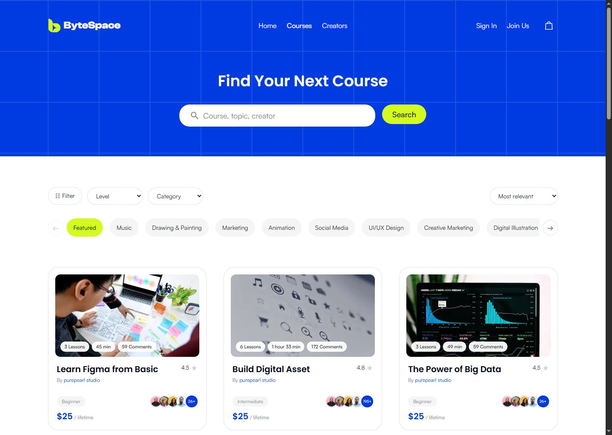
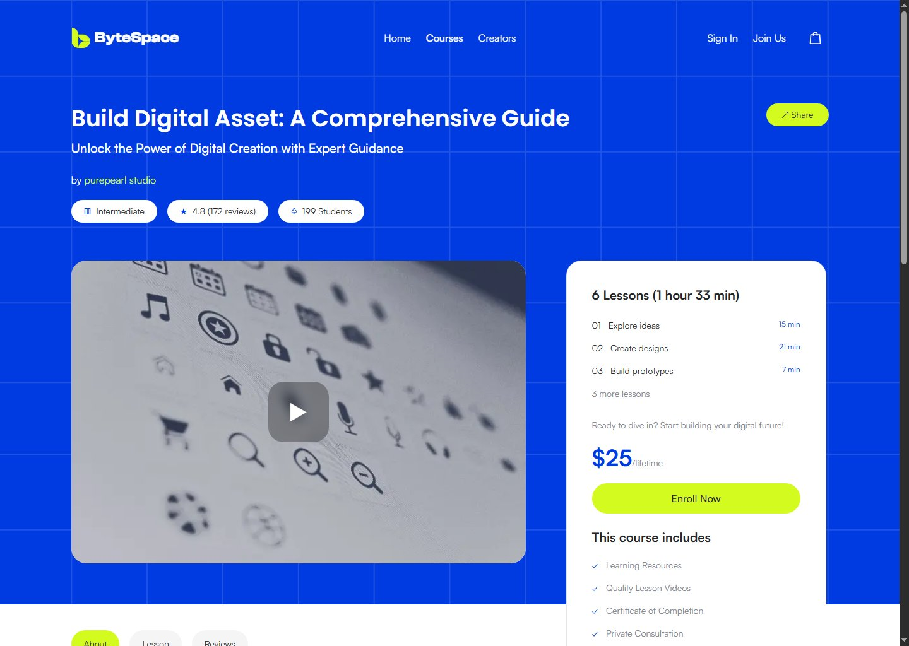
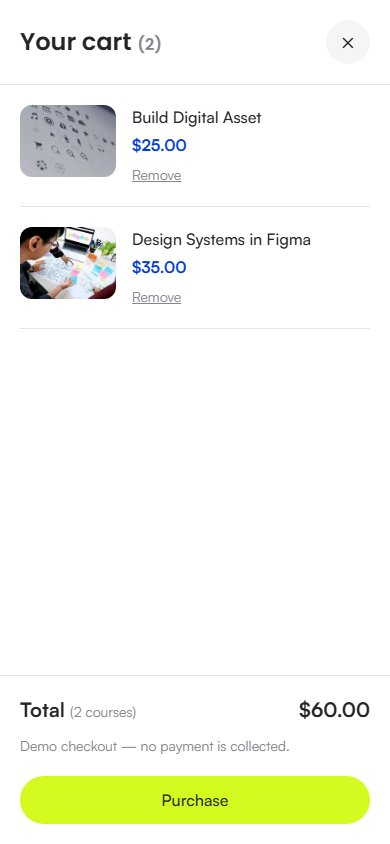

# ByteSpace

**Learn, create, and grow.** A responsive course marketplace interface built with Next.js, TypeScript, and Tailwind CSS.

ByteSpace brings course discovery, learning content, creator profiles, and a shopping-cart experience into one consistent interface. The application uses typed sample data and reusable components, with clear places to connect a backend later.


## Application preview

These screenshots show the running application with sample content.

| Course discovery                                                                            | Course details                                                                                        |
| ------------------------------------------------------------------------------------------- | ----------------------------------------------------------------------------------------------------- |
|  |  |

<p align="center">
  
</p>

## Features

- **Responsive landing page:** hero, partners, learning paths, featured courses, creator sections, testimonials, and footer.
- **Course discovery:** keyword search, categories, level and price filters, sorting, pagination, empty states, and loading skeletons.
- **Shared category navigation:** touch scrolling, mouse dragging, and smooth arrow controls.
- **Course experience:** About, Lesson, and Reviews pages share a preview and enrollment layout. Videos load on demand; reviews can be filtered by rating.
- **Creator profiles:** biography, catalog filtering, product counts, and a device-local Follow interaction.
- **Interactive cart:** desktop and mobile count badges, fly-to-cart animation, duplicate prevention, removal, totals, and a demo purchase confirmation.
- **Persistent local state:** cart contents, lesson progress, and followed creators survive a browser reload.
- **Consistent navigation:** a rounded floating header on scroll, independent action hover states, and a mobile navigation menu.
- **Shared 404 page:** unknown routes and missing course, lesson, or creator records use the same page.
- **Accessibility:** labeled controls, keyboard-accessible cart dialog, focus restoration, and reduced-motion support.

## Technology

| Area       | Implementation                                         |
| ---------- | ------------------------------------------------------ |
| Framework  | Next.js 16, App Router                                 |
| UI         | React 19 and TypeScript                                |
| Styling    | Tailwind CSS 4 and shared CSS theme tokens             |
| Data       | Typed local fixtures behind async repository functions |
| Images     | Next.js Image and local assets                         |
| Typography | Locally hosted Satoshi, Poppins, and Clash Display     |
| Quality    | ESLint, TypeScript, and Prettier                       |

## Run locally

Requires **Node.js 20.9 or newer** and npm.

```bash
npm ci
npm run dev
```

Open [localhost:3000](http://localhost:3000).

The sample application does not require environment variables or a database.

To run a production build locally:

```bash
npm run build
npm start
```

## Development commands

| Command                | Purpose                                                           |
| ---------------------- | ----------------------------------------------------------------- |
| `npm run dev`          | Start the development server                                      |
| `npm run build`        | Create the production build                                       |
| `npm start`            | Serve the production build                                        |
| `npm run lint`         | Run ESLint                                                        |
| `npm run typecheck`    | Check TypeScript without emitting files                           |
| `npm run format`       | Format supported project source, configuration, and documentation |
| `npm run format:check` | Check formatting without changing files                           |

Prettier settings live in `.prettierrc.json`. Generated files, dependencies, exported assets, and screenshots are excluded through `.prettierignore`.

## Routes

| Route                         | Page                                    |
| ----------------------------- | --------------------------------------- |
| `/`                           | Landing page                            |
| `/courses`                    | Search and course catalog               |
| `/courses/[courseId]`         | Course overview                         |
| `/courses/[courseId]/lessons` | Modules, lesson selection, and progress |
| `/courses/[courseId]/reviews` | Rating summary and written reviews      |
| `/creators`                   | Creator directory                       |
| `/creators/[creatorId]`       | Creator profile and catalog             |
| `/register`                   | Registration interface                  |
| `/sign-in`                    | Sign-in interface                       |

Try `/courses/build-digital-asset` and `/creators/purepearl-studio` to explore the sample content.

Catalog filters are represented in the URL. For example: `/courses?category=UI%2FUX%20Design&level=Beginner`.

## Project structure

```text
src/
├── app/
│   ├── (auth)/          # Registration and sign-in layouts
│   ├── (marketing)/     # Landing, courses, and creators
│   ├── globals.css      # Fonts, theme tokens, and shared styles
│   └── not-found.tsx    # Root not-found boundary
├── components/
│   ├── auth/            # Shared authentication forms and showcase
│   ├── cart/            # Cart provider, drawer, and enrollment action
│   ├── course/          # Catalog, details, modules, and reviews
│   ├── creator/         # Creator interactions
│   ├── layout/          # Site frame, header, and shared 404 content
│   ├── marketing/       # Landing sections and footer
│   └── ui/              # Reusable fields, progress, ratings, and scrolling
├── data/                # Course and creator fixtures
├── lib/                 # Catalog queries and local preferences
└── types/               # Course, lesson, review, and creator contracts
public/                  # Fonts, images, and design reference assets
docs/screenshots/        # Application screenshots used in this README
```

## Website design

The interface is based on the supplied **ByteSpace website Figma design** and page reference screenshots:

[View the ByteSpace Figma design](https://www.figma.com/design/prsyGQoD6ekkridj7FnIgQ/ByteSpace-New-Check-website--Copy-?node-id=47-351)

The visual system uses Persian blue (`#003BE2`), electric lime (`#D4FB20`), rounded cards, grid backgrounds, and clear typographic hierarchy. Existing artwork and ornaments are reused across pages. Where an exact image export was unavailable, the implementation uses existing project artwork.

Design credit belongs to the original design creators; this repository implements the supplied interface with responsive layouts and working frontend interactions.

## Data and backend integration

The catalog currently contains 24 sample courses. `src/lib/course-catalog.ts` exposes async query functions, while `src/types/index.ts` defines the contracts used by the UI. Replace the repository functions with API requests while preserving their return shapes.

The implementation keeps these concerns separate:

- **Catalog data:** course summaries, modules, lesson metadata, rating aggregates, reviews, and creator identity.
- **Server-rendered content:** route pages and course layouts, with loading and error boundaries.
- **Browser interactions:** filters, scrolling, video playback, cart state, following, and progress.

The following features are demonstrations awaiting backend services:

- Registration, sign-in, social authentication, and newsletter signup are not connected.
- Purchase clears the cart and shows a success message; **no payment is collected and no enrollment is created**.
- Progress and following are stored on the current device, not an authenticated account.
- Some lessons have sample metadata without a published video.
- Ratings, review totals, creator details, and course content are sample data.

For production checkout, validate course availability and pricing on the server and create enrollments only after confirmed payment.
